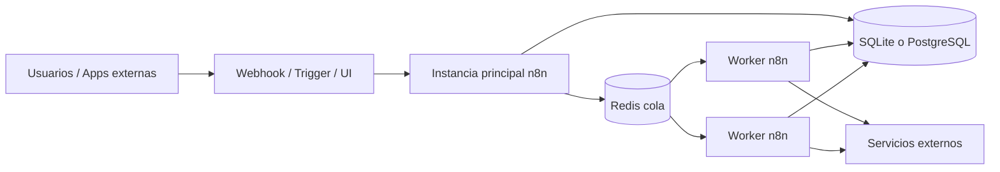
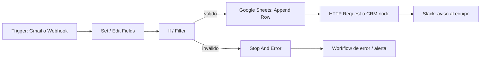
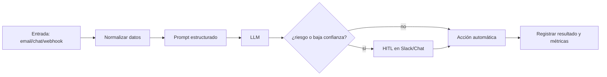

# Automatizaciones con n8n para principiantes

## Resumen ejecutivo

n8n es una plataforma de automatización visual orientada a equipos técnicos que combina integración de aplicaciones, transformación de datos y, cada vez más, capacidades de IA. Su propuesta diferencial no es solo “conectar apps”, sino permitir automatizaciones de complejidad media y alta con nodos, expresiones, webhooks, código, control de errores y despliegues tanto gestionados como autohospedados. La documentación oficial la presenta como una herramienta fair-code con más de 400 integraciones, soporte cloud y self-hosted, y una capa de IA basada en nodos de lenguaje, agentes y RAG. citeturn2view0turn13search0turn22search15

Para una persona que empieza, la conclusión práctica es clara: conviene aprender n8n en dos fases. Primero, dominar los fundamentos sin IA —triggers, nodos, credenciales, expresiones, webhooks, HTTP Request, Google Sheets, Gmail, Slack y un CRM— porque ahí se construye el 80 % de las automatizaciones operativas. Después, añadir IA de forma incremental, empezando por clasificación, extracción y borradores asistidos, y dejando agentes, RAG y fine-tuning para cuando ya existan pruebas, métricas y controles humanos. Esa progresión está alineada con las guías oficiales de n8n sobre evaluaciones, RAG y revisión humana, y con las recomendaciones de entity["company","OpenAI","ai company"] sobre prompting, latencia, seguridad y evaluación. citeturn10view5turn23view2turn23view3turn16search1turn16search3turn31search10

En hosting, la opción más simple para principiantes es n8n Cloud, porque elimina operación de infraestructura y ofrece OAuth gestionado, upgrades con un clic y monitorización de uptime. En cambio, el autohosting con entity["company","Docker","container platform"] o Docker Compose tiene más sentido cuando necesitas control de datos, red, integración con infraestructura propia, modelos locales, o escalado con PostgreSQL, Redis y workers. La propia documentación de n8n recomienda el self-hosting para usuarios expertos y avisa de que errores de operación pueden causar pérdida de datos, problemas de seguridad o caídas. citeturn11view3turn2view1turn4view1turn28view0turn2view2

En IA, la decisión estratégica no es “usar IA sí o no”, sino qué proveedor usar para cada caso. Con entity["company","Hugging Face","ml platform"] y entity["company","Ollama","local llm platform"] puedes cubrir casos open-source y locales; con OpenAI cubres casos gestionados de mayor madurez operativa. A nivel de costes y latencia, OpenAI factura por tokens pero ofrece prompt caching y Batch; Hugging Face ofrece facturación pay-as-you-go sin markup y endpoints dedicados; y Ollama desplaza el coste desde la factura por token a tu propio hardware y operación. En todo caso, para un curso inicial conviene enseñar que la IA debe ir siempre acompañada de trazabilidad, evaluación, límites de contexto, revisión humana en acciones de riesgo y una política explícita de datos. citeturn14search0turn16search0turn19view1turn19view6turn21view0turn21view1turn23view2turn17search9

## Qué es n8n y cómo está construido

Un workflow de n8n es una colección de nodos conectados que automatizan un proceso. Los workflows pueden ejecutarse manualmente durante el desarrollo o automáticamente cuando se publica un flujo que comienza con un trigger o un webhook. Un trigger es el nodo que inicia la ejecución cuando ocurre un evento o se cumple una condición; en producción, todo workflow automático necesita ese punto de entrada. citeturn6view1turn6view2turn6view7turn6view0

Los conceptos clave que debe dominar un principiante son estos:

| Concepto | Qué significa en la práctica |
|---|---|
| Workflow | El proceso automatizado completo; encadena nodos y define la lógica de extremo a extremo |
| Node | La unidad básica: puede leer, transformar, decidir o escribir datos |
| Trigger | El disparador inicial: webhook, horario, correo recibido, formulario, etc. |
| Credentials | La forma segura de autenticar nodos contra APIs y servicios |
| Expressions | Sintaxis `{{ ... }}` para mapear datos dinámicos, fechas, resultados previos y variables |
| Data items | n8n mueve datos como arrays de objetos, normalmente bajo `json`, y opcionalmente `binary` |

Esta síntesis sale directamente de la documentación de workflows, expresiones y estructura de datos: n8n pasa la información entre nodos como arrays de objetos; las expresiones permiten usar datos previos (`$json`, `$("Nodo").first()`, `$now`, `$today`) y son la base del mapeo flexible entre sistemas. citeturn27view2turn2view5turn6view9turn6view8

A nivel arquitectónico, una instalación pequeña suele funcionar en modo regular: una única instancia atiende la UI, recibe webhooks y ejecuta workflows. A medida que crecen usuarios, flujos y concurrencia, n8n recomienda `queue mode`, donde la instancia principal recibe timers y webhooks, crea la ejecución, coloca el ID en Redis, y workers separados recuperan la carga desde Redis y leen el estado del workflow en la base de datos. El propio apartado de scaling indica que `queue` es el modo con mejor escalabilidad. citeturn2view4turn2view2turn24search14

La persistencia depende del despliegue. Por defecto, n8n usa SQLite para credenciales, ejecuciones y workflows; también soporta PostgreSQL. En self-hosted, la instalación parte de SQLite y puede migrarse a PostgreSQL por variables de entorno; en n8n Cloud, el backend cambia según plan, con SQLite en trial, Starter y Pro, y PostgreSQL en Enterprise Scaling. Además, desde v1.0 la documentación declara obsoleto el soporte de MySQL y MariaDB. citeturn27view0turn27view1

En seguridad, las credenciales se cifran antes de guardarse en base de datos usando una clave de cifrado. n8n genera una clave aleatoria en el primer arranque, pero para producción la práctica correcta es fijar `N8N_ENCRYPTION_KEY` y reutilizarla en todos los workers si hay queue mode. Sobre esa base, los planes Enterprise añaden secretos externos, RBAC, proyectos y log streaming, mientras que la auditoría de seguridad ayuda a detectar credenciales no usadas, expresiones peligrosas en SQL, nodos de riesgo, community nodes y otros puntos sensibles. citeturn4view5turn4view4turn8view3turn8view0

## Instalación, hosting y operación base

La primera decisión pedagógica importante es elegir el hosting correcto para el perfil del alumnado. n8n Cloud es la opción más accesible para empezar: según su documentación es la solución alojada por n8n, sin setup técnico ni mantenimiento, con monitorización continua de uptime, OAuth gestionado y actualizaciones con un clic. Por el contrario, la sección de self-hosting avisa de que autohospedar exige saber de servidores, contenedores, recursos, seguridad y configuración, y recomienda Cloud si no tienes experiencia operando infraestructura. citeturn11view3turn2view1

| Opción | Cuándo elegirla | Ventajas | Inconvenientes |
|---|---|---|---|
| n8n Cloud | Curso inicial, PoC, equipos sin DevOps | Cero mantenimiento, OAuth gestionado, upgrades simples | Menor control de red e infraestructura; límites por plan |
| Docker simple | Aprendizaje técnico, laboratorio, entorno personal | Instalación rápida, control de datos y entorno | Operación manual, backups y seguridad a tu cargo |
| Docker Compose con PostgreSQL | Equipos pequeños con producción ligera | Mejor persistencia, separación de servicios, más robustez | Más complejidad operativa |
| Self-hosted escalado con PostgreSQL + Redis + workers | Producción con carga, control y cumplimiento | Escalabilidad, control de red, integración con secretos y monitoreo propio | Mayor coste operativo, diseño y hardening necesarios |

La tabla anterior sintetiza el material oficial de Cloud, Docker, Docker Compose y scaling. En Cloud, a fecha de 27 de abril de 2026, la página de precios indica que todos los planes incluyen usuarios y workflows ilimitados y que la tarificación se basa en ejecuciones mensuales; el plan Starter parte de 20 €/mes facturado anualmente con 2,5K ejecuciones y 5 ejecuciones concurrentes, mientras que Pro parte de 50 €/mes facturado anualmente con 20 ejecuciones concurrentes y más capacidades de equipo. citeturn11view3turn4view3turn12search0turn12search3

Para Docker, la vía mínima oficial crea un volumen persistente y arranca la imagen `docker.n8n.io/n8nio/n8n` exponiendo el puerto 5678, con zona horaria, permisos del settings file y runners habilitados. La documentación también ofrece una variante igual de directa para PostgreSQL, añadiendo `DB_TYPE=postgresdb` y el bloque de variables de conexión. El punto más importante aquí no es memorizar el comando, sino comprender que la persistencia del directorio `.n8n` sigue siendo necesaria incluso con PostgreSQL porque ahí viven, entre otros, las claves de cifrado, logs y activos de source control. citeturn28view1turn28view0

En Docker Compose, n8n documenta un flujo más serio para Linux: instalar Docker y Compose, preparar DNS, crear `.env`, montar un directorio `local-files`, definir `compose.yaml` y arrancar el stack. El valor didáctico de esta ruta es alto porque introduce al alumno en variables de entorno, volúmenes, reverse proxy y HTTPS seguro, que son piezas reales de operación de automatizaciones. citeturn4view1

Para producción, la recomendación de arquitectura es: SQLite para laboratorio o uso ligero; PostgreSQL para producción real; Redis y workers para concurrencia alta; métricas y health checks para observabilidad; y un esquema de pruning y copias de seguridad para limitar crecimiento de ejecuciones y binarios. La documentación de monitoring expone `/healthz`, `/healthz/readiness` y `/metrics`; esta última no está disponible en Cloud y está desactivada por defecto en self-hosted. Además, n8n recomienda backups nocturnos y advierte de que ejecuciones perdidas durante una caída no son recuperables sin arquitectura adicional delante del servicio. citeturn10view6turn8view6turn12search5

## Automatizaciones sin IA

Para principiantes, la enseñanza debe comenzar con un patrón estable: **trigger → normalización de datos → reglas de negocio → escritura en sistema destino → notificación → manejo de errores**. Esto aprovecha los bloques que mejor documenta n8n: trigger nodes, expresiones, nodos core, integraciones con Gmail, Google Sheets, Slack, HTTP Request y webhooks. citeturn6view0turn6view3turn6view4turn6view5turn6view6turn2view6

### Ejemplo guiado sin IA

**Caso:** un lead entra por correo, se registra, se envía al canal comercial y se sincroniza con el CRM.

**Paso inicial.** Usa un **Gmail Trigger** con el evento *Message Received*. Este nodo puede iniciar el workflow cuando llega nuevo correo y se autentica con credenciales de Google. En una primera clase compensa usar una cuenta de pruebas y una etiqueta o buzón dedicado para no mezclar tráfico real. citeturn6view10turn6view4

**Normalización.** Añade un nodo **Edit Fields** o **Set** para dejar un objeto homogéneo con `email`, `subject`, `body`, `receivedAt` y, por ejemplo, `leadSource="gmail"`. Aquí se introducen expresiones como `{{ $json.subject }}` o `{{ $now }}` y la idea de que cada nodo trabaja ítem por ítem sobre arrays de objetos. citeturn2view5turn27view2

**Filtrado.** Incorpora un nodo **If** para descartar ruido: autores bloqueados, newsletters o mensajes sin dominio corporativo. Este tramo es el mejor momento para enseñar que no todo debe automatizarse; un flujo útil suele comenzar simplificando entradas, no añadiendo complejidad. La quickstart oficial de “Your first workflow” ya usa un nodo lógico para representar decisiones dentro del flujo. citeturn6view0

**Registro.** Envía el lead a **Google Sheets** con *Append Row* o *Append or Update Row*. Este nodo soporta creación, lectura y actualización de documentos y hojas, y resulta ideal como bitácora visible para alumnos porque les permite inspeccionar salidas sin tener que entrar aún en una base de datos. citeturn6view5

**Sincronización con CRM.** Si existe un nodo dedicado para tu CRM y la operación que necesitas está soportada, úsalo. Si no, n8n recomienda recurrir a **HTTP Request**; la sección de integraciones explica que algunos nodos no exponen todas las operaciones posibles de la API y que el nodo HTTP sirve como escape hatch para acciones custom o servicios sin nodo específico. Este mismo patrón es válido para Salesforce, Pipedrive, HubSpot o CRMs internos. citeturn26view0turn6view3

**Notificación.** Termina con **Slack** para avisar al canal comercial con un resumen breve y un enlace a la fila en Google Sheets o al CRM. Slack es muy buen destino didáctico porque cierra el loop operacional: el alumno ve que la automatización no solo mueve datos, sino que activa a personas. citeturn6view6

### Ejemplo guiado con Webhook

**Caso:** un formulario o una tienda online envía un pedido a n8n.

El **Webhook node** sirve para recibir datos de apps externas y arrancar un workflow incluso cuando no existe integración dedicada. La documentación oficial subraya que tiene URL de prueba y de producción, soporta autenticación básica, header o JWT, y permite responder inmediatamente, al final del flujo o con el nodo **Respond to Webhook**. También fija por defecto un payload máximo de 16 MB, ampliable en self-hosted con `N8N_PAYLOAD_SIZE_MAX`. citeturn2view6turn1search10

A efectos docentes, este ejemplo es excelente porque enseña cuatro nociones fundamentales a la vez: diferencia entre test y producción, seguridad de entrada, diseño de payload y desacoplamiento entre emisor y workflow. Una vez entra el pedido, el flujo puede validar campos, registrar pedido en Google Sheets, avisar por Slack y crear una entidad en el CRM o ERP mediante HTTP Request. El repositorio oficial de plantillas y la librería pública de workflows muestran precisamente este tipo de patrones para ventas, soporte y eCommerce. citeturn25search3turn25search19

## Automatizaciones con IA

n8n incorpora una capa de IA sobre su motor de workflows. La documentación avanzada indica que esta funcionalidad está disponible en Cloud y self-hosted a partir de la línea 1.19.4, y que n8n expone nodos de LangChain, agentes, modelos, memoria, herramientas y evaluaciones para construir desde chatbots sencillos hasta flujos RAG. citeturn22search15turn2view7turn23view1turn23view3

### Comparativa rápida de proveedores y enfoque

| Proveedor | Modelo operativo | Fortalezas | Limitaciones habituales |
|---|---|---|---|
| **entity["company","OpenAI","ai company"]** | API gestionada | Buena experiencia para empezar, documentación madura, ecosistema de prompting, evals, fine-tuning, pricing y caching | Coste por token, dependencia de tercero, revisar políticas de datos |
| **entity["company","Hugging Face","ml platform"]** | Inferencia serverless o endpoints dedicados | Acceso amplio a modelos open-source, PAYG sin markup, endpoints dedicados y ecosistema open | La calidad/latencia depende del modelo y proveedor subyacente |
| **entity["company","Ollama","local llm platform"]** | Inferencia local o cloud compatible | Control del dato, API local, compatibilidad OpenAI, métricas de uso y latencia | Requiere hardware y operación propios; calidad ligada al modelo y cuantización |

La tabla anterior resume documentación oficial de OpenAI, Hugging Face y Ollama. En OpenAI, la página de precios muestra cobro por tokens y servicios complementarios; el prompt caching puede reducir latencia hasta un 80 % y costes de input hasta un 90 %, y el Batch API reduce precio a costa de asincronía. Hugging Face documenta créditos mensuales, facturación PAYG sin markup y endpoints dedicados con facturación horaria por minuto. Ollama, por su parte, ofrece API local por defecto en `http://localhost:11434/api`, expone métricas de generación como `total_duration` y `eval_duration`, y además publica compatibilidad OpenAI para reutilizar tooling existente. citeturn14search0turn16search0turn16search1turn19view1turn19view6turn21view0turn21view1turn21view3

### Ejemplo guiado con OpenAI

**Caso:** clasificar correos de soporte, redactar un borrador y exigir revisión humana antes de responder.

La forma más sensata de introducir IA en una primera clase no es con un agente totalmente autónomo, sino con un patrón de **copiloto**: el modelo clasifica, extrae y propone; una persona aprueba la acción final. En n8n, esto puede hacerse combinando un trigger de entrada, un nodo de modelo, lógica condicional y revisión humana para herramientas sensibles. La documentación de n8n insiste en que la revisión humana es especialmente útil cuando el flujo puede enviar mensajes, modificar registros o borrar datos. citeturn23view2turn31search10

**Paso inicial.** Recibe el correo con Gmail Trigger, compacta los datos con Edit Fields y prepara un prompt claro. Las guías de prompting de OpenAI recomiendan dar instrucciones precisas, contexto, formato esperado y ejemplos cuando ayuden al modelo a seguir la tarea. La documentación de n8n sobre AI coding repite el mismo principio: ejemplos, pasos explícitos y formato de salida reducen errores. citeturn16search3turn16search13turn22search10

**Nodo de IA.** Usa el nodo **OpenAI** de n8n para chatear con un modelo o, si quieres un flujo más estructurado, un chain/agent según el caso. El nodo oficial soporta varias operaciones de OpenAI, incluidas conversaciones y otras capacidades del proveedor. Si la operación exacta no está expuesta —por ejemplo, ciertos endpoints avanzados— n8n permite orquestarla con HTTP Request utilizando credenciales o llamadas personalizadas. citeturn2view8turn11view11turn26view0

**Prompt recomendado para clase.**  
“Clasifica este correo en `facturación`, `incidencia técnica`, `alta/baja`, `spam` o `otro`. Devuelve JSON con `category`, `urgency`, `summary` y `draft_reply`. Si faltan datos, indícalo.”  
Este patrón es mejor que pedir “resume y responde” en lenguaje libre porque enseña una idea central de automatización con IA: **salidas estructuradas primero; acciones después**. Esa forma de diseñar reduce ambigüedad y facilita auditar el flujo. La recomendación es coherente con la guía de prompt engineering y con el enfoque de evaluaciones de n8n. citeturn16search3turn10view5

**Revisión humana.** En lugar de enviar la respuesta automáticamente, manda la propuesta a Slack y exige aprobación. n8n permite human-in-the-loop en herramientas conectadas a AI Agent y documenta canales como Chat, Slack, Telegram, Gmail o Teams. También permite mostrar al revisor el nombre de la herramienta y los parámetros que la IA quiere usar mediante `$tool` y `$fromAI()`. citeturn23view2

### Ejemplo guiado con un modelo open-source vía Hugging Face

El nodo **Hugging Face Inference Model** de n8n sirve para usar modelos de Hugging Face, pero tiene una limitación didácticamente muy importante: **no tiene soporte de tools**, por lo que no funciona con AI Agent; debe conectarse, por ejemplo, con **Basic LLM Chain**. Esto lo convierte en una buena opción para enseñar clasificación, resumen o reformulación, pero no para una primera clase de agentes con herramientas. citeturn23view0

Un ejercicio apropiado consiste en recibir texto desde un formulario o chat, pasarlo por un Basic LLM Chain con un modelo open-source y registrar el resultado. Hugging Face documenta dos rutas de coste: usar Inference Providers con facturación centralizada y créditos mensuales, o endpoints dedicados con infraestructura autoscalable gestionada. En ambos casos, para un curso inicial es mejor recalcar que “open-source” no significa automáticamente “gratis en producción”: la inferencia sigue teniendo coste, ya sea como factura PAYG o como infraestructura dedicada. citeturn19view1turn19view6

### Ejemplo guiado con modelo local vía Ollama

El nodo **Ollama Model** de n8n también carece de tools support y, por tanto, se usa mejor con Basic LLM Chain que con AI Agent. Esa limitación es importante porque evita prometer autonomía total con modelos locales en una primera clase. Aun así, es una excelente vía para enseñar privacidad, control del dato y reducción de dependencia de terceros. citeturn2view9

Ollama publica una API local por defecto en `http://localhost:11434/api`, ofrece una imagen oficial de Docker para Linux y compatibilidad con el formato OpenAI Chat Completions, de modo que mucho tooling existente puede reaprovecharse apuntando a `localhost`. Además, su API devuelve métricas de uso como duración total, duración de carga, tokens procesados y duración de evaluación, lo que resulta perfecto para enseñar a medir latencia real en vez de asumirla. citeturn21view0turn21view2turn21view3turn21view1

### Prompting, RAG y fine-tuning

Para principiantes, el orden correcto es: **prompting → evaluación → RAG → fine-tuning**. OpenAI documenta mejores prácticas de prompt engineering y un ciclo de optimización del modelo que pasa por recopilar ejemplos, subir un dataset en JSONL, lanzar un fine-tuning job y evaluar. n8n, por su lado, documenta que la evaluación es necesaria porque los LLM no son deterministas como el código tradicional y que RAG mejora respuestas al conectarlas con datos externos y actualizados. En otras palabras: antes de entrenar un modelo, suele ser mejor mejorar el prompt, medir, y añadir recuperación de contexto. citeturn16search2turn16search6turn10view5turn23view3

## Buenas prácticas, riesgos y cumplimiento

### Buenas prácticas operativas

La primera buena práctica es **versionar**. n8n guarda workflows como JSON y permite exportarlos e importarlos; además, los planes Business y Enterprise soportan source control basado en Git con entornos. La propia documentación aclara que esto no sustituye a Git completo: no implementa por sí mismo un flujo de revisión tipo pull request, y no sincroniza los valores reales de credenciales y variables con Git, solo sus stubs. Por eso, para producción la pauta correcta es combinar source control para el diseño del workflow con secretos externos o provisión separada de credenciales por entorno. citeturn10view0turn10view1turn10view2turn8view4

La segunda buena práctica es **testear sin castigar sistemas externos**. n8n tiene pinning y mocking de datos para desarrollo: puedes simular datasets, fijar la salida de un nodo, editarla y reutilizarla en pruebas futuras. Eso ahorra llamadas a APIs, evita agotar cuotas y da consistencia a las pruebas de edge cases. En IA, la extensión natural de esta idea son las evaluaciones ligeras antes del despliegue y las evaluaciones métricas cuando ya existe histórico de producción. citeturn10view3turn10view5

La tercera buena práctica es **diseñar el error como parte del flujo**. n8n permite definir un error workflow y también forzar fallos controlados con **Stop And Error** para disparar ese pipeline cuando una condición de negocio lo requiera. Esto es más profesional que dejar “errores silenciosos” y, en una clase inicial, enseña a tratar la observabilidad como un requisito funcional. citeturn10view4turn9search14

La cuarta buena práctica es **instrumentar el sistema**. n8n documenta logging configurable, endpoints `/healthz`, `/healthz/readiness` y `/metrics` en self-hosted, y log streaming en planes Enterprise. Junto a eso, conviene activar pruning de ejecuciones y binarios para proteger rendimiento de base de datos y almacenamiento, sobre todo si trabajas con archivos o IA multimodal. citeturn8view1turn10view6turn8view2turn12search5turn12search8

### Seguridad, cumplimiento y riesgos éticos

En seguridad de plataforma, la base mínima es: clave de cifrado fija, secretos fuera de los workflows cuando sea posible, RBAC por proyectos, y auditoría periódica. n8n cifra credenciales con una encryption key, soporta external secrets en planes Enterprise con proveedores como 1Password, AWS Secrets Manager, Azure Key Vault, GCP Secret Manager y HashiCorp Vault, y organiza permisos mediante proyectos y roles. citeturn4view5turn4view4turn8view3

En seguridad de automatizaciones con IA, los riesgos principales son **prompt injection**, **fuga de datos privados**, **acciones irreversibles mal autorizadas** y **exceso de automatización**. OpenAI documenta expresamente que las prompt injections son ataques comunes y peligrosos, capaces de provocar exfiltración de datos o tool calls indebidas, y recomienda controles propios: conectar solo servidores o fuentes confiables, registrar herramientas y mensajes, y segmentar accesos cuando haya datos sensibles. n8n responde a esa misma necesidad con human-in-the-loop para herramientas de riesgo alto. citeturn31search1turn31search8turn31search10turn23view2

Desde el punto de vista de protección de datos, cualquier workflow que trate datos personales debe respetar los principios del RGPD: licitud, lealtad y transparencia; limitación de la finalidad; minimización de datos; exactitud; limitación del plazo de conservación; integridad y confidencialidad; y responsabilidad proactiva. La entity["organization","Comisión Europea","eu executive body"] también subraya que los datos deben guardarse el menor tiempo necesario. En la práctica, eso significa no enviar a un LLM más contexto del imprescindible, redactar logs, definir retención, y revisar transferencias a terceros, incluidos proveedores de IA y servidores MCP. citeturn29search5turn29search1turn29search21turn17search9turn31search2

En el marco de la IA, la UE ya aplica el AI Act y las obligaciones para modelos GPAI entraron en aplicación el 2 de agosto de 2025. La documentación oficial resume obligaciones generales sobre documentación técnica, política de copyright y resumen de contenidos de entrenamiento, y obligaciones adicionales para GPAI con riesgo sistémico, incluyendo mitigación de riesgos, reporte de incidentes y ciberseguridad. Para el usuario de n8n esto no significa que cada automatización sea automáticamente “alto riesgo”, pero sí que debe elegir proveedor, contrato, trazabilidad y supervisión con conocimiento de ese contexto regulatorio. citeturn30search15turn30search1turn30search4turn30search9

### Limitaciones y preguntas abiertas

Las limitaciones técnicas más relevantes para principiantes son cuatro. Primera: los nodos de Hugging Face y Ollama en n8n no soportan tools y, por tanto, no encajan igual de bien que OpenAI en ciertos escenarios de agentes. Segunda: n8n Cloud simplifica mucho, pero no ofrece métricas Prometheus y no garantiza IPs salientes estáticas. Tercera: source control en n8n no resuelve por sí solo la promoción completa de credenciales entre entornos. Cuarta: community nodes y nodos capaces de ejecutar código o tocar filesystem amplían superficie de riesgo y deben tratarse con criterio. citeturn23view0turn2view9turn10view6turn12search1turn10view1turn8view0

La limitación metodológica de esta entrega es que el TXT adjunto no venía transcrito íntegramente en el prompt, por lo que la integración se ha hecho sobre los temas visibles del archivo y no sobre una edición línea a línea del texto original. Aun así, la reescritura cubre y amplía claramente sus ideas nucleares. fileciteturn0file0

## Clase inicial de dos horas

### Objetivos de aprendizaje

Al final de la sesión, una persona principiante debería ser capaz de:

- explicar qué es un workflow, qué hace un trigger y cómo circulan los datos entre nodos en n8n; citeturn6view1turn6view7turn27view2
- desplegar n8n en Cloud o entender el arranque mínimo con Docker y persistencia; citeturn11view3turn28view0
- construir una automatización sin IA con Gmail, Google Sheets, Slack y HTTP Request o Webhook; citeturn6view4turn6view5turn6view6turn6view3turn2view6
- añadir IA de forma segura para clasificar o resumir, con prompting estructurado y revisión humana cuando la acción tenga impacto; citeturn16search3turn23view2turn31search10
- identificar buenas prácticas mínimas de testing, errores, observabilidad, seguridad y cumplimiento. citeturn10view3turn10view4turn10view6turn29search5

### Agenda por tiempos

| Bloque | Tiempo | Contenido | Actividad práctica |
|---|---:|---|---|
| Apertura | 10 min | Qué es n8n, qué problemas resuelve, mapa del curso | Debate guiado: “qué tareas repetitivas hago hoy” |
| Fundamentos | 20 min | Workflows, nodes, triggers, credentials, expressions, estructura de datos | Crear un workflow vacío y recorrer la UI |
| Hosting | 15 min | Cloud vs Docker vs self-hosted | Leer y comentar el comando oficial de Docker |
| Caso sin IA | 30 min | Gmail Trigger → Set → Google Sheets → Slack → HTTP Request/CRM | Construcción guiada del flujo |
| Caso con IA | 25 min | Clasificación y borrador de respuesta con OpenAI/HF/Ollama | Ajustar prompt y revisar salida |
| Buenas prácticas | 10 min | pinning, error workflow, health checks, roles, secretos | Activar una prueba de error manejado |
| Ejercicios | 10 min | Mini-reto individual | Resolver y comentar |
| Cierre | 10 min | Plantillas, recursos y próximos pasos | Exportar workflow JSON |

La agenda está planteada para que la parte práctica pese más que la teoría. Esto encaja con la propia documentación de quickstarts, “Your first workflow”, templates y cursos introductorios de n8n, que priorizan construir flujos mientras se aprenden conceptos. citeturn6view0turn3search9turn22search1

### Ejercicios prácticos con soluciones

**Ejercicio uno.** Crea un workflow que reciba un correo, extraiga asunto y remitente, lo añada a Google Sheets y avise por Slack.

**Solución esperada.**  
`Gmail Trigger → Edit Fields → Google Sheets (Append Row) → Slack`  
Con un Set intermedio, define `subject`, `from`, `receivedAt`. En Sheets, mapea cada columna con expresiones. En Slack, formatea un mensaje corto con `{{ $json.subject }}` y `{{ $json.from }}`. citeturn6view10turn6view5turn6view6turn2view5

**Ejercicio dos.** Expón un Webhook que reciba JSON de un formulario y cree un lead en un CRM usando HTTP Request.

**Solución esperada.**  
`Webhook → If (validación) → HTTP Request → Respond to Webhook`  
Usa la URL de prueba para desarrollo y la de producción al publicar. Añade autenticación si el origen no es completamente controlado. Devuelve `200` con mensaje de confirmación o `400/500` cuando falle validación o ejecución. citeturn2view6turn1search10turn6view3

**Ejercicio tres.** Clasifica una consulta de soporte con IA y obliga a revisar la respuesta antes de enviarla.

**Solución esperada.**  
`Gmail/Webhook → Edit Fields → OpenAI o Basic LLM Chain → Slack de revisión → acción final`  
Pide salida estructurada (`category`, `urgency`, `draft_reply`) y no envíes directamente al cliente. Si la salida es ambigua o la urgencia es alta, deriva a un humano. En agentes con herramientas, configura human review para el paso que realice el envío. citeturn23view2turn16search3turn31search10

### Recursos, lecturas y material visual recomendado

Los recursos que más valor aportan para una primera clase son estos, en este orden:

- **Quickstart “Your first workflow”** y **Workflows/Create and run** para aprender el modelo mental básico de trigger, lógica y publicación. citeturn6view0turn6view2
- **Expressions** y **How n8n structures data** para entender por qué los datos “encajan” o “no encajan” entre nodos. citeturn2view5turn27view2
- **Docker**, **Docker Compose**, **Self-hosting**, **Queue mode** y **Scaling overview** para enseñar despliegue y arquitectura. citeturn2view1turn4view1turn2view2turn24search14
- **OpenAI node**, **Hugging Face Inference Model**, **Ollama Model**, **AI Agent**, **RAG in n8n** y **Human-in-the-loop** para la parte de IA. citeturn2view8turn23view0turn2view9turn23view1turn23view3turn23view2
- **Prompt engineering**, **latency optimization**, **prompt caching** y **fine-tuning best practices** de OpenAI para enseñar que la IA no es magia, sino ingeniería de contexto, coste y evaluación. citeturn16search3turn16search1turn16search0turn16search2
- **Inference Providers / Pricing** y **Security** de Hugging Face, y **API / Usage / OpenAI compatibility** de Ollama para modelos open-source y locales. citeturn19view1turn19view4turn21view0turn21view1turn21view3

Si quieres “capturas o diagramas” dentro del material de clase, las mejores referencias oficiales para enlazar desde el `.md` son: la captura del workflow completo de *Your first workflow*, el diagrama oficial de Queue Mode, y la captura del Webhook node mostrando URL de prueba y producción. Las tres están en la documentación oficial y sirven muy bien como apoyo visual. citeturn6view0turn2view2turn2view6

### Casos de uso por sector y plantillas

- **Ventas.** Captura, cualificación y seguimiento de leads con Gmail, Google Sheets, Slack y CRM. La librería pública de workflows muestra plantillas específicas de follow-up comercial y lead nurturing. citeturn25search0turn25search4turn25search19
- **Soporte.** Entrada por Gmail o Webhook, ticketing, notificación interna y, si procede, IA para triage o borradores. Hay plantillas oficiales y comunitarias para soporte con Gmail, Trello, Slack y variantes AI-powered. citeturn25search1turn25search13turn25search20
- **eCommerce.** Procesado de pedidos, confirmaciones, alertas internas y sincronización con ERP/CRM. La librería pública incluye flujos con webhook y correo para order processing. citeturn25search3
- **Ingeniería y conocimiento interno.** Chat con modelos open-source o locales, y RAG sobre documentación con proveedores como OpenAI, Hugging Face u Ollama. citeturn25search2turn25search6turn25search14
- **Finanzas y reporting.** Automatización de cuadros, predicciones o consolidación de datos con Sheets y APIs. La galería pública muestra ejemplos de revenue predictions y reporting automatizado. citeturn25search11

## Integración y actualización del TXT

El TXT adjunto presentaba, al menos en su contenido visible, una introducción general a n8n como herramienta para optimizar procesos, con usos prácticos en marketing, gestión de datos, atención al cliente e integración con IA, además de ventajas como ahorro de tiempo, reducción de errores, escalabilidad, flexibilidad y personalización. Esa base se ha respetado, pero se ha transformado en un material de clase mucho más estructurado, actual y accionable. fileciteturn0file0

Los cambios realizados sobre ese texto base son estos:

- se ha pasado de un texto divulgativo general a una **clase completa de 2 horas** con objetivos, agenda y bloques prácticos;  
- se ha añadido una **arquitectura técnica** de n8n con modo regular y queue mode, base de datos, Redis, workers y cifrado de credenciales;  
- se ha incorporado una **comparativa de hosting** entre Cloud, Docker y self-hosted escalado;  
- se han desarrollado **ejemplos paso a paso sin IA** y **con IA** usando Gmail, Google Sheets, Slack, HTTP Request, webhooks, OpenAI, Hugging Face y Ollama;  
- se han añadido **buenas prácticas de versionado, testing, manejo de errores, observabilidad, seguridad y cumplimiento**;  
- se han incorporado **diagramas mermaid**, tablas comparativas y ejercicios con solución;  
- se ha actualizado el marco de **costes, latencia, privacidad y regulación** usando documentación oficial y material actual de proveedores y organismos. citeturn2view2turn11view3turn28view0turn23view0turn2view9turn14search0turn19view1turn30search15turn29search5

Como no se facilitó en el prompt una transcripción completa del TXT original, la integración se ha hecho **temáticamente** a partir del archivo adjunto visible y no como una edición comparada frase a frase. Aun así, el resultado mantiene el núcleo del texto inicial y lo eleva a un formato docente y profesional apto para una primera clase real. fileciteturn0file0